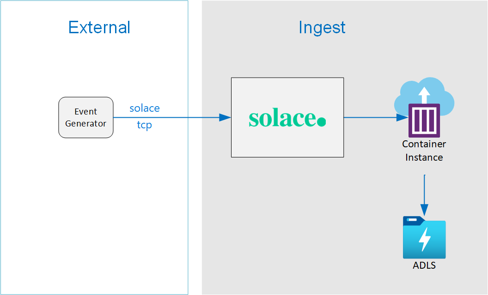

# Solace Azure Datalake Storage Demo

This project demonstrates how to fetch messages from Solace Pubsub+ to Azure Data Lake Storage (ADLS) using several Azure technologies:

- Azure Container Instance
- Azure Data Lake Storage (ADLS)

Workflow:

- Generator App sents message to Solace PubSub+
- Python App will read messages and push to ADLS



# Setup

This setup will deploy the core infrastructure needed to run the the solution:

- Core Infratructure
- Generator App

## Core infrastructure

Configure the variables.

```bash
# Global
export RG_NAME=solace_demo
export RG_REGION=westus
export STORAGE_ACCOUNT_NAME=solace_demo

# Solace
export SOLACE_VM_NAME=solace-vm

# Python App
export EH_NAMESPACE=LogicAppDemoEhn
export EH_NAME=logic_app_demo_eh

# Stream Analytics
export SA_JOB_NAME=logic_app_demo_sa
export SA_INPUT_NAME=RawEventHub
export SA_OUTPUT_NAME=FilteredEventHub

# Logic App variables
export LOGIC_APP_NAME=TicketApp
```


### Solace PubSub+ Event Broker

Build the solace docker image.

```code
cd /path/to/project/solace/
docker-compose -f PubSubStandard_singleNode.yml up -d

# Open solice at http://localhost:8080/

```

# References
- Setting up Solace https://docs.solace.com/Solace-SW-Broker-Set-Up/Docker-Containers/Set-Up-Docker-Container-Image.htm
- Setting up Solace windows docker https://docs.solace.com/Solace-SW-Broker-Set-Up/Docker-Containers/Set-Up-Docker-Container-Windows.htm